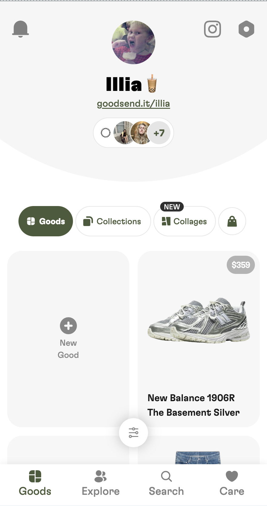
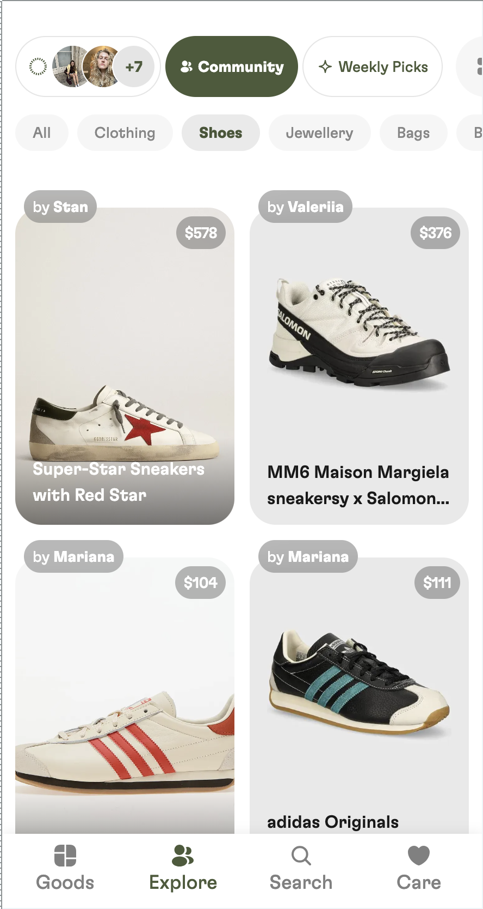
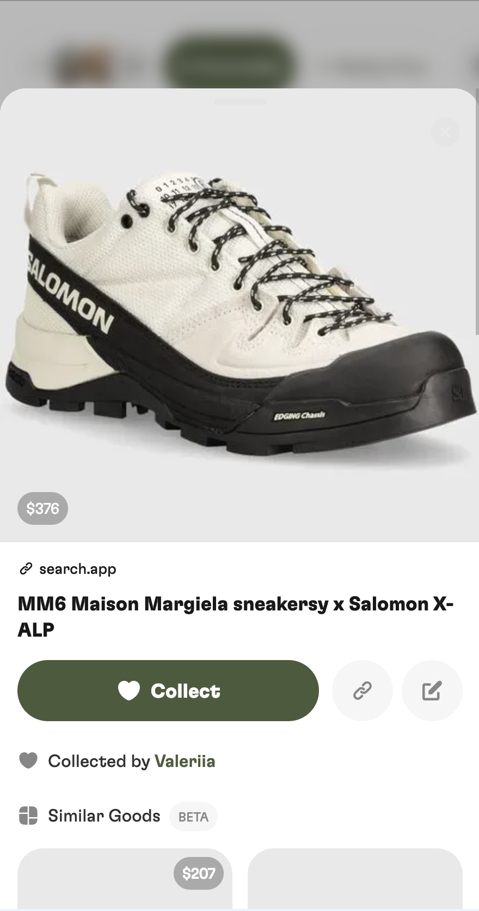

# Pre-requisite
Goodsend is a **social wishlist app** that lets users save products with a simple tap, organize them into collections or collages, share with friends, and explore products shared by others.

DAU ~200 users

Images of product:
User profile          |     Explore (chronological) page |     Good(item) modal
:-------------------------:|:-------------------------:|:-------------------------:
  |   |  
# Why 

## Overview
Implement For You recommendation system, that will provide personal goods recomendations based on user preferences.

## Motivation
At the moment, user can explore new goods from friends feed, chronological feed or one for all users curated weekly feed.

**Hypothesis:** If we implement For You feed with personalized recommendations we will improve user experience in exploring new items, increase engagement, retention rate and session time.

# Success metrics 
Increased engagement (DAU, session time, retention rate)

## Requirements & Constraints
Potentialy can be not feasibly due to small amount of users/goods.

Should work only on users with sufficient data(>10 goods, tbd)

- Users should receive a personalized feed with at least 5 recommended items per day, based on their past activity, saved products, and interaction with other users' collections.
- **Cost Efficiency:** not crazy cost's in terms of compute(<$25-50/month), models desirably should run on CPU
- **Scalability:** The recommendation system should be designed to scale as the user base grows, ensuring that the system remains performant even as new users and more complex datasets are added.

Current goods count: ~100,000
Current users count: ~5000

Cold-start problem is out of scope.

# How
## Problem statement
Content-based approach, user-to-item rec system (potentially hybrid approach, include collaborative aspect)

## Data
Chronological user goods sequence(Good#1 -> Good#3 -> Good#345)

Goods(image, MobileClip image embedding, title, url(can extract domain, or instagram handle))

## Techniques
### Tried(spent 15 minutes, might need to try again):
- finding closest good to an average of all user goods Clip embeddings. performed poorly, lacked diversity
- clustering user's goods embeddings, and recomending closest to each cluster average. also preformed poorly(might explore why)
- doing svd on collaborative matrix. performed poorly

### To try:
I see potential in using chronological goos sequence as predicting next good. (Good#1 -> Good#3 -> Good#345)
- predicting next item in goods embedding sequence using transformer/rnn
- ? graph nn's, pinterest uses them
- explore papers for user-to-item prediction

## Evalutaion
- Do a time-based split on user's goods and evaluate how well model predicts next goods(or a vector that is similar to the next goods).
- Visual vibe check, how well product team likes recommendations

ChatGPT said: Precision @ K, Recall @ K, Diversity Score. Need to explore where to get data or label data for the evaluation.

## Implementation
TBD: Decide if system will need regular model retraining/fine-tuning or one time.

### Data-Flow Diagram
User actions(saving/collecting good) ->
Data Storage(PostgreSQL) ->
Cron Job triggered ->
Preprocessing ->
Rec System(Model training/inference, candidate searching, ranking) ->
Save recs to db ->
For You Page

### Infra
DigitalOcean

### Performance (Throughput, Latency)
If recommedations to be generated on cron, scaling for model training/inference is not needed

### Monitoring & Alarms
Betterstack for logs.
Send telegram message on job fail + info about inference.
Monitor manually suggestions for other users.

# Appendix
TODO: add results of experiments

# Potential matches with datascience-fails
1. Limited Data Volume and Quality
2. Vague Success Metrics
3. Overly Complex Models for the Problem Scope
4. Evaluation Methodology and Experimentation
5. Unclear Handling of Data Drift and Model Retraining
6. Lack of Expertise and Team Skills